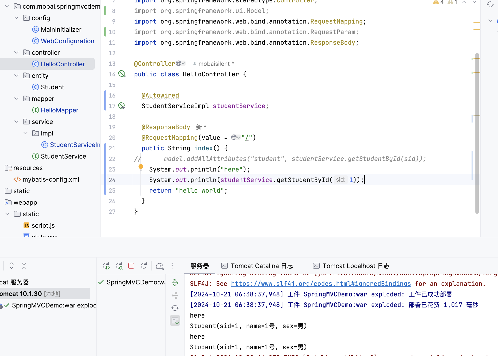
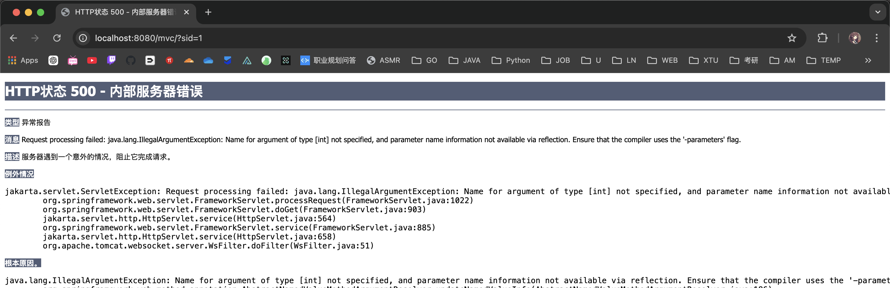
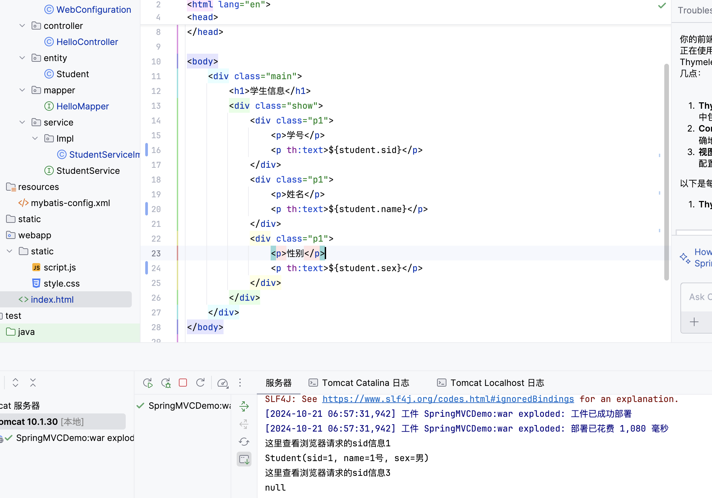
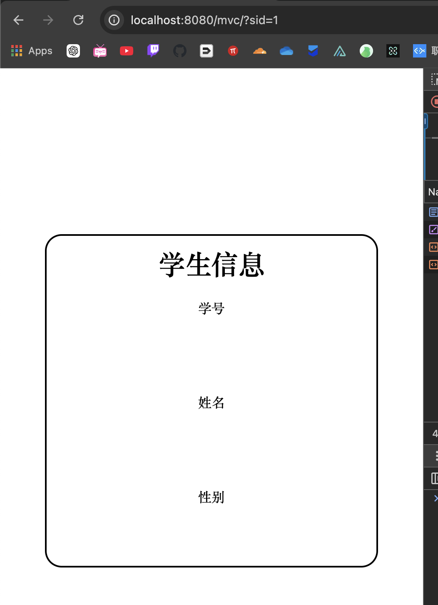
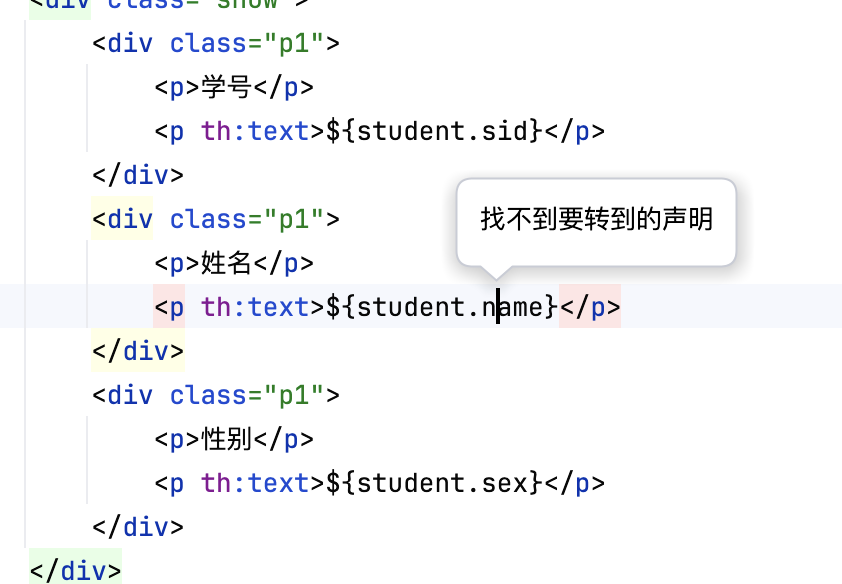
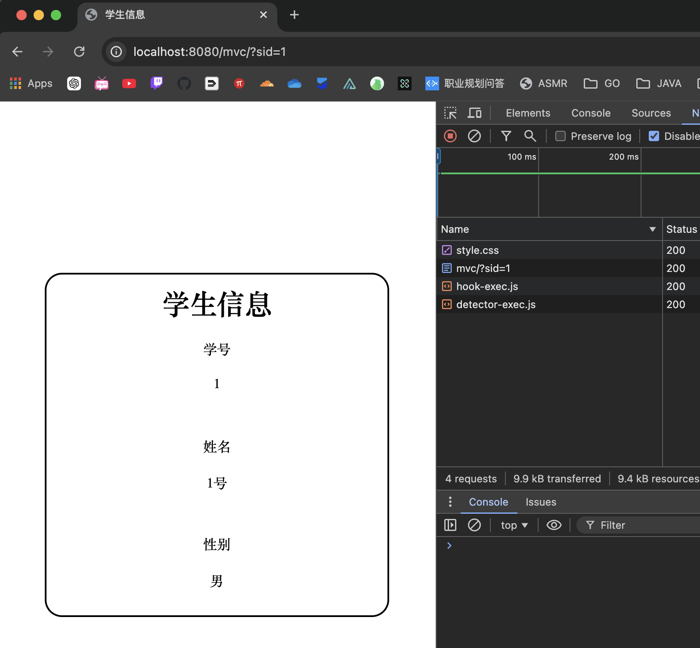

# SpringMVCDemo
SpringMVCDemo，尽量按照规范书写项目代码，完善笔记，写一个完备点的Demo。

技术栈

- Tomcat
- Spring
- SpringMVC
- Thymeleaf
- Mybatis
- Maven
- Web

## 1.传统web项目结构图


> 这几层架构算是很多简要项目的核心了，其他再多也只是在上面添加其他功能而已

## 2.创建项目，编辑config

> 具体略，记得添加Tomcat服务器即可。

创建config包，添加基础配置文件

config

- MainInitializer
- WebConfiguration

编辑内容如下

MainInitializer.java

```java
package com.mobai.springmvcdemo.config;

import org.springframework.web.servlet.support.AbstractAnnotationConfigDispatcherServletInitializer;


public class MainInitializer extends AbstractAnnotationConfigDispatcherServletInitializer {

  @Override
  protected Class<?>[] getRootConfigClasses() {
    return new Class[]{WebConfiguration.class};   //基本的Spring配置类，一般用于业务层配置
  }

  @Override
  protected Class<?>[] getServletConfigClasses() {
    return new Class[0];  //配置DispatcherServlet的配置类、主要用于Controller等配置，这里为了教学简单，就不分这么详细了，只使用上面的基本配置类
  }

  @Override
  protected String[] getServletMappings() {
    return new String[]{"/"};    //匹配路径，与上面一致
  }
}
```

> 创建初始dispatchser，关于dispatcher
>
> **分发员**，详细介绍可见这篇：
>
> https://experienceleague.adobe.com/zh-hans/docs/experience-manager-learn/dispatcher-tutorial/chapter-1
>
> 详细的spring dispatcher也可以见这篇：
>
> https://juejin.cn/post/6979800528662298654


WebConfiguration.java

> 这里是**直接和业务层打交道**了。注册Bean部件，添加Bean内容

```java
package com.mobai.springmvcdemo.config;

import org.springframework.context.annotation.ComponentScan;
import org.springframework.context.annotation.ComponentScans;
import org.springframework.context.annotation.Configuration;
import org.springframework.web.servlet.config.annotation.EnableWebMvc;

@Configuration
@EnableWebMvc   //快速配置SpringMvc注解，如果不添加此注解会导致后续无法通过实现WebMvcConfigurer接口进行自定义配置
@ComponentScans({
        @ComponentScan("com.mobai.springmvcdemo.entity"),
        @ComponentScan("com.mobai.springmvcdemo.controller")
})
public class WebConfiguration {

}
```

> 添加扫描器

顺便先创建了entity工具包

controller工具包的HelloController对象如下：

```java
package com.mobai.springmvcdemo.controller;

import org.springframework.stereotype.Controller;
import org.springframework.web.bind.annotation.RequestMapping;
import org.springframework.web.bind.annotation.ResponseBody;

@Controller
public class HelloController {
  @ResponseBody
  @RequestMapping("/")
  public String index(){
    return "HelloWorld!";
  }
}
```

> 处理根目录下的请求，这里是Hello开头的组件，如果和这个组件相互配合工作的包也应该是Hello开头

项目跑起来如下：注意修改Tomcat下的部署路径


添加的核心依赖如下：

- thymeleaf
- spring-webmvc

## 3.Thymeleaf创建网页，创建Student类

Student.java

```java
package com.mobai.springmvcdemo.entity;

import lombok.Data;

@Data
public class Student {
  int sid;
  String name;
  String sex;
}
```

编辑的html视图如下：


> 简洁美观，那就可以了。

index.html

```html
<!DOCTYPE html>
<html lang="en">

<head>
    <meta charset="UTF-8">
    <title>学生信息</title>
    <link rel="stylesheet" type="text/css" href="./static/style.css">
</head>

<body>
    <div class="main">
        <h1>学生信息</h1>
        <div class="show">
            <div class="p1">
                <p>学号</p>
                <p>${student.id}</p>
            </div>
            <div class="p1">
                <p>姓名</p>
                <p>${student.name}</p>
            </div>
            <div class="p1">
                <p>性别</p>
                <p>${student.sex}</p>
            </div>
        </div>
    </div>
</body>

</html>
```

style.css

```css
* {
    margin: 0;
    padding: 0;
    box-sizing: border-box;
}

.main {
    position: absolute;
    width: 400px;
    height: 400px;
    /* background: pink; */
    padding-top: 10px;
    left: 50%;
    top: 50%;
    transform: translate(-50%, -50%);
    border-radius: 20px;
    border: 2px solid #000;
    overflow: hidden;
    text-align: center;
}

.show {
    width: 100%;
    height: 88%;
    display: flex;
    flex-direction: column;
}

p {
    margin-top: 20px;
    /* 有些时候省事直接margin也是很好的选择 */
}

.p1 {
    flex: 1;
    /* background-color: aqua; */
}

.p2 {
    flex: 1;
    /* background-color: yellow; */
}

.p3 {
    flex: 1;
    /* background-color: rosybrown; */
}
```

现在项目架构如下；


肉眼可见，没有解析出来index.html文件，

之前配置的WebConfiguration显然只是能处理return的原始信息而已，需要做如下修改，解析webapp里面的网页信息。

WebConfiguration.java

```java
package com.mobai.springmvcdemo.config;

import org.springframework.context.annotation.Bean;
import org.springframework.context.annotation.ComponentScan;
import org.springframework.context.annotation.ComponentScans;
import org.springframework.context.annotation.Configuration;
import org.springframework.web.servlet.config.annotation.EnableWebMvc;

@Configuration
@EnableWebMvc   //快速配置SpringMvc注解，如果不添加此注解会导致后续无法通过实现WebMvcConfigurer接口进行自定义配置
@ComponentScans({
        @ComponentScan("com.mobai.springmvcdemo.entity"),
        @ComponentScan("com.mobai.springmvcdemo.controller")
})
public class WebConfiguration {
  //我们需要使用ThymeleafViewResolver作为视图解析器，并解析我们的HTML页面
  @Bean
  public ThymeleafViewResolver thymeleafViewResolver(SpringTemplateEngine springTemplateEngine) {
    ThymeleafViewResolver resolver = new ThymeleafViewResolver();
    resolver.setOrder(1);   //可以存在多个视图解析器，并且可以为他们设定解析顺序
    resolv  er.setCharacterEncoding("UTF-8");   //编码格式是重中之重
    resolver.setTemplateEngine(springTemplateEngine);   //和之前JavaWeb阶段一样，需要使用模板引擎进行解析，所以这里也需要设定一下模板引擎
    return resolver;
  }

  //配置模板解析器
  @Bean
  public SpringResourceTemplateResolver templateResolver() {
    SpringResourceTemplateResolver resolver = new SpringResourceTemplateResolver();
    resolver.setSuffix(".html");   //需要解析的后缀名称
    resolver.setPrefix("/");   //需要解析的HTML页面文件存放的位置，默认是webapp目录下，如果是类路径下需要添加classpath:前缀
    return resolver;
  }

  //配置模板引擎Bean
  @Bean
  public SpringTemplateEngine springTemplateEngine(ITemplateResolver resolver) {
    SpringTemplateEngine engine = new SpringTemplateEngine();
    engine.setTemplateResolver(resolver);   //模板解析器，默认即可
    return engine;
  }
}
```


出现无法导入想要的包的情况，问题如下：

```xml
  <dependency>
      <groupId>org.springframework</groupId>
      <artifactId>spring-webmvc</artifactId>
      <version>6.1.14</version>
  </dependency>
  <dependency>
      <groupId>org.thymeleaf</groupId>
      <artifactId>thymeleaf-spring6</artifactId>
      <version>3.1.2.RELEASE</version>
  </dependency>
```

> 这两个依赖的顺序不能乱，先spring-webmvc  -->. thymeleaf

现在能够导向道index.html了，但是问题如下；


> 无法顺利导入css文件


可见，需要配置resolve使其能够正确的解析css文件。

向WebConfiguration中添加下列信息：

```java
@Override
public void configureDefaultServletHandling(DefaultServletHandlerConfigurer configurer) {
    configurer.enable();   //开启默认的Servlet
}

@Override
public void addResourceHandlers(ResourceHandlerRegistry registry) {
    registry.addResourceHandler("/static/**").addResourceLocations("/static/");
    //配置静态资源的访问路径
}
```

现在显示正确了。

> 格外，尤其注意WebConfiguration的一步一步配置。

## 4.创建数据库配置和mapper

创建数据库略。

> 还是采取sid来搜索学生吧
>
> http://localhost:8080/mvc/?sid=1

注意导入依赖。

HelloMapper.java

```java
package com.mobai.springmvcdemo.mapper;

import com.mobai.springmvcdemo.entity.Student;
import org.apache.ibatis.annotations.Select;

public interface HelloMapper {
  @Select("select * from student where sid = #{sid}")
  public Student getStudentById(int sid);
}
```

继续向WebConfiguration中添加信息

```java
  //注册SqlSessionTemplate的Bean
  @Bean
  public SqlSessionTemplate sqlSessionTemplate() throws IOException {
    SqlSessionFactory factory = new SqlSessionFactoryBuilder().build(Resources.getResourceAsReader("mybatis-config.xml"));
    return new SqlSessionTemplate(factory);
  }
  // 这里是通过xml信息配置数据库，事实上还可以直接通WebConfiguration配置数据库,这里先就算了
```

> 创建mybatis-config.xml，其实这里只是将SqlSessionFactore注册到SpringMVC管理的config中

## 5.创建service

> 业务层，由表示层调用，然后由数据访问层实现

service.HelloServide.java

```java
package com.mobai.springmvcdemo.service;

import org.springframework.stereotype.Service;

@Service
public interface StudentService {
  Student getStudentById(int sid);
}
```

service.Impl.HelloServiceImpl

```java
package com.mobai.springmvcdemo.service.Impl;

import com.mobai.springmvcdemo.entity.Student;
import com.mobai.springmvcdemo.mapper.HelloMapper;
import com.mobai.springmvcdemo.service.StudentService;
import org.apache.ibatis.annotations.Mapper;
import org.springframework.beans.factory.annotation.Autowired;
import org.springframework.stereotype.Service;

@Service
public class StudentServiceImpl implements StudentService {

  @Autowired
  HelloMapper helloMapper;

  @Override
  public Student getStudentById(int sid) {
    Student student = helloMapper.getStudentById(sid);
    return student;
  }
}
```

添加自动注入的时候发生错误如下：


这个是依赖于mybatis-spring

别怀疑，就是有依赖没导入好，要使用数据库，得导入下面这几个依赖：

- mybatis
- mysql
- mybatis-spring
- spring-jdbc


这里添加@Service即可

> 即使是可以直接通过Mapper获取Student也不要这么做，因为数据库信息是需要做额外处理的。

## 6.测试业务层能否正常使用数据库

```java
import com.mobai.springmvcdemo.service.Impl.StudentServiceImpl;
import org.junit.jupiter.api.Test;

public class Main {
  @Test
  public void test() {
    StudentServiceImpl test = new StudentServiceImpl();
    System.out.println(test.getStudentById(1));
  }
}
```

测试失败，注册mapper失效？


> 是啊，还是需要多练，不然这里报错，那里报错。

> 搞着搞着就部署工件出错了

错误排查：

最开始是this.helloMapper is null，将HelloMapper添加@Mapper注解之后，变为this.studentServiceImpl is null

总之，显而易见是有什么没注册到Spring容器里面去。按照最开始的Spring学习部分倒是注解context.getBean方法直接获取。

也就是对注解开发还有不懂的地方。


> 现在是既使用注解开发又使用配置文件，算是二者合一了，尝试通过注解获取mybaits获取数据源？使用Hikari
>
> 之后再看看视频里面的处理方式，视频中是使用全注解的形式注册Mybatis

解决方案是修改WebConfiguration如下；里面包含了数据源的配置	

```java
@Bean   //单独创建一个Bean，方便之后更换
public DataSource dataSource(){
  return new PooledDataSource("com.mysql.cj.jdbc.Driver",
          "jdbc:mysql://localhost:3306/SpringMVCDemo", "root", "mobaisilent");
}

@Bean
public SqlSessionFactoryBean sqlSessionFactoryBean(DataSource dataSource){  //直接参数得到Bean对象
  SqlSessionFactoryBean bean = new SqlSessionFactoryBean();
  bean.setDataSource(dataSource);
  return bean;
}
// 由于Bean来管理数据库源，Mybatis算是用来创建Mapper的
```

结果如下：



直接在controller中调试，直接用MainTest调试老师发生问题，估计不方便注册到Bean中或者说从Bean中提取信息。

## 7.结合下Themeleaf和HelloController即可

修改HelloController.java如下：

```java
package com.mobai.springmvcdemo.controller;

import com.mobai.springmvcdemo.service.Impl.StudentServiceImpl;
import org.springframework.beans.factory.annotation.Autowired;
import org.springframework.stereotype.Controller;
import org.springframework.ui.Model;
import org.springframework.web.bind.annotation.RequestMapping;
import org.springframework.web.bind.annotation.RequestParam;
import org.springframework.web.bind.annotation.ResponseBody;

@Controller
public class HelloController {

  @Autowired
  StudentServiceImpl service;

  @ResponseBody
  @RequestMapping(value = "/")
  public String index(@RequestParam int sid, Model model) {
//    model.addAttribute("student", service.getStudentById(sid));
    System.out.println("here");
    System.out.println(service.getStudentById(1));
    return "index";
  }
}
```

发生错误如下：


解决方式：添加build插件如下：

```xml
<plugin>
    <groupId>org.apache.maven.plugins</groupId>
    <artifactId>maven-compiler-plugin</artifactId>
    <version>3.13.0</version>
    <configuration>
        <compilerArgs>
            <arg>-parameters</arg>
        </compilerArgs>
    </configuration>
</plugin>
```

> 这种问题好像曾经发生过，下次务必注意。

下一个问题是：





可见及时后端有从数据库查询的信息，但是依旧前端无法解析出来。

没有配置Thymeleaf的解析器？



这种就是没有成功匹配的意思吧。

原因不是没配置好model解析器，这个在WebConfiguration里面已经配置好了，最开始就配置好了。

原因是因为上面的语法写错了，呵呵。

> 如果能够正确跳转过去就是配置好了。

## 8.流程图

> 手动理下流程图，万事万物都会非常清晰起来。


> 初学阶段是容易出现一些问题，好在是问题都解决好了。



> 这里强调那几个注入和注解

````bash
.
├── java
│   └── com
│       └── mobai
│           └── springmvcdemo
│               ├── config
│               │   ├── MainInitializer.java
│               │   └── WebConfiguration.java
│               ├── controller
│               │   └── HelloController.java
│               ├── entity
│               │   └── Student.java
│               ├── mapper
│               │   └── HelloMapper.java
│               └── service
│                   ├── Impl
│                   │   └── StudentServiceImpl.java
│                   └── StudentService.java
├── resources
│   └── mybatis-config.xml
├── static
│   └── style.css
└── webapp
    ├── index.html
    └── static
        ├── script.js
        └── style.css

15 directories, 12 files
````

这里还是展示下所有代码吧。

### config

MainInitializer.java

> 配置Dispatcher

```java
package com.mobai.springmvcdemo.config;

import org.springframework.web.servlet.support.AbstractAnnotationConfigDispatcherServletInitializer;

public class MainInitializer extends AbstractAnnotationConfigDispatcherServletInitializer {

  @Override
  protected Class<?>[] getRootConfigClasses() {
    return new Class[]{WebConfiguration.class};   //基本的Spring配置类，一般用于业务层配置
  }

  @Override
  protected Class<?>[] getServletConfigClasses() {
    return new Class[0];  //配置DispatcherServlet的配置类、主要用于Controller等配置，这里为了教学简单，就不分这么详细了，只使用上面的基本配置类
  }

  @Override
  protected String[] getServletMappings() {
    return new String[]{"/"};    //匹配路径，与上面一致
  }
}
```

WebConfiguration.java

> 算是Bean注册中心了

```java
package com.mobai.springmvcdemo.config;

import com.zaxxer.hikari.HikariDataSource;
import org.apache.ibatis.datasource.pooled.PooledDataSource;
import org.apache.ibatis.io.Resources;
import org.apache.ibatis.session.SqlSessionFactory;
import org.apache.ibatis.session.SqlSessionFactoryBuilder;
import org.mybatis.spring.SqlSessionFactoryBean;
import org.mybatis.spring.SqlSessionTemplate;
import org.mybatis.spring.annotation.MapperScan;
import org.springframework.context.annotation.Bean;
import org.springframework.context.annotation.ComponentScan;
import org.springframework.context.annotation.ComponentScans;
import org.springframework.context.annotation.Configuration;
import org.springframework.web.servlet.config.annotation.DefaultServletHandlerConfigurer;
import org.springframework.web.servlet.config.annotation.EnableWebMvc;
import org.springframework.web.servlet.config.annotation.ResourceHandlerRegistry;
import org.springframework.web.servlet.config.annotation.WebMvcConfigurer;
import org.thymeleaf.spring6.SpringTemplateEngine;
import org.thymeleaf.spring6.templateresolver.SpringResourceTemplateResolver;
import org.thymeleaf.spring6.view.ThymeleafViewResolver;
import org.thymeleaf.templateresolver.ITemplateResolver;

import javax.sql.DataSource;
import java.io.IOException;

@Configuration
@EnableWebMvc   //快速配置SpringMvc注解，如果不添加此注解会导致后续无法通过实现WebMvcConfigurer接口进行自定义配置
@ComponentScans({
        @ComponentScan("com.mobai.springmvcdemo.entity"),
        @ComponentScan("com.mobai.springmvcdemo.controller"),
        @ComponentScan("com.mobai.springmvcdemo.service"),
})
@MapperScan("com.mobai.springmvcdemo.mapper")
public class WebConfiguration implements WebMvcConfigurer {
  //我们需要使用ThymeleafViewResolver作为视图解析器，并解析我们的HTML页面
  @Bean
  public ThymeleafViewResolver thymeleafViewResolver(SpringTemplateEngine springTemplateEngine) {
    ThymeleafViewResolver resolver = new ThymeleafViewResolver();
    resolver.setOrder(1);   //可以存在多个视图解析器，并且可以为他们设定解析顺序
    resolver.setCharacterEncoding("UTF-8");   //编码格式是重中之重
    resolver.setTemplateEngine(springTemplateEngine);   //和之前JavaWeb阶段一样，需要使用模板引擎进行解析，所以这里也需要设定一下模板引擎
    return resolver;
  }

  //配置模板解析器
  @Bean
  public SpringResourceTemplateResolver templateResolver() {
    SpringResourceTemplateResolver resolver = new SpringResourceTemplateResolver();
    resolver.setSuffix(".html");   //需要解析的后缀名称
    resolver.setPrefix("/");   //需要解析的HTML页面文件存放的位置，默认是webapp目录下，如果是类路径下需要添加classpath:前缀
    return resolver;
  }

  //配置模板引擎Bean
  @Bean
  public SpringTemplateEngine springTemplateEngine(ITemplateResolver resolver) {
    SpringTemplateEngine engine = new SpringTemplateEngine();
    engine.setTemplateResolver(resolver);   //模板解析器，默认即可
    return engine;
  }
  
  // 上面三个Bean都是模版视图解析器
  
  
  
  // 下面是配置信息

  @Override
  public void configureDefaultServletHandling(DefaultServletHandlerConfigurer configurer) {
    configurer.enable();   //开启默认的Servlet
  }

  @Override
  public void addResourceHandlers(ResourceHandlerRegistry registry) {
    registry.addResourceHandler("/static/**").addResourceLocations("/static/");
    //配置静态资源的访问路径
  }
  
  
  
  // 下面是数据库

  @Bean   //单独创建一个Bean，方便之后更换
  public DataSource dataSource(){
    return new PooledDataSource("com.mysql.cj.jdbc.Driver",
            "jdbc:mysql://localhost:3306/SpringMVCDemo", "root", "mobaisilent");
  }

  @Bean
  public SqlSessionFactoryBean sqlSessionFactoryBean(DataSource dataSource){  //直接参数得到Bean对象
    SqlSessionFactoryBean bean = new SqlSessionFactoryBean();
    bean.setDataSource(dataSource);
    return bean;
  }
}
```

### controller

HelloCtroleler.java

> 配置Servlet信息，注意@Controller和@Autowired

```java
package com.mobai.springmvcdemo.controller;

import com.mobai.springmvcdemo.service.Impl.StudentServiceImpl;
import org.springframework.beans.factory.annotation.Autowired;
import org.springframework.stereotype.Controller;
import org.springframework.ui.Model;
import org.springframework.web.bind.annotation.RequestMapping;
import org.springframework.web.bind.annotation.RequestParam;
import org.springframework.web.bind.annotation.ResponseBody;

@Controller
public class HelloController {

  @Autowired
  StudentServiceImpl service;

  @RequestMapping(value = "/")
  public String index(@RequestParam int sid, Model model) {
    model.addAttribute("student", service.getStudentById(sid));
    System.out.println("这里查看浏览器请求的sid信息" + sid);
    System.out.println(service.getStudentById(sid));
    return "index";
  }
}
```

### entity

Student.java

> 配置实体模型

```java
package com.mobai.springmvcdemo.entity;

import lombok.Data;
import lombok.ToString;

@Data
@ToString
public class Student {
  int sid;
  String name;
  String sex;
}
```

### mapper

HelloMapper.java

```java
package com.mobai.springmvcdemo.mapper;

import com.mobai.springmvcdemo.entity.Student;
import org.apache.ibatis.annotations.Mapper;
import org.apache.ibatis.annotations.Select;
import org.springframework.stereotype.Service;

public interface HelloMapper {
  @Select("select * from student where sid = #{sid}")
  public Student getStudentById(int sid);
}
// 注意这里要添加@Mapper注解，也就是注册到Spring容器中，这样Spring容器才能扫描到这个接口，从而生成代理对象，这样我们才能使用这个接口。
```

### Service

StudentService.java

> 配置学生查询接口，注意@Service

```java
package com.mobai.springmvcdemo.service;

import com.mobai.springmvcdemo.entity.Student;
import org.springframework.stereotype.Service;

@Service
public interface StudentService {
  Student getStudentById(int sid);
}
```

#### Impl

StudentServiceImpl.java

> 学生接口的实现，注意@Servie和@Autowired

```java
package com.mobai.springmvcdemo.service.Impl;

import com.mobai.springmvcdemo.entity.Student;
import com.mobai.springmvcdemo.mapper.HelloMapper;
import com.mobai.springmvcdemo.service.StudentService;
import jakarta.annotation.Resource;
import org.springframework.beans.factory.annotation.Autowired;
import org.springframework.stereotype.Service;

@Service
public class StudentServiceImpl implements StudentService {

  @Autowired
  HelloMapper helloMapper;

  @Override
  public Student getStudentById(int sid) {
    return helloMapper.getStudentById(sid);
  }
}
```

mybaits-config.xml信息就不展示了，这个没用上，毕竟是全注解开发，都没直接用到mapper

### webapp

#### static

sytle.css

```css
* {
    margin: 0;
    padding: 0;
    box-sizing: border-box;
}

.main {
    position: absolute;
    width: 400px;
    height: 400px;
    /* background: pink; */
    padding-top: 10px;
    left: 50%;
    top: 50%;
    transform: translate(-50%, -50%);
    border-radius: 20px;
    border: 2px solid #000;
    overflow: hidden;
    text-align: center;
}

.show {
    width: 100%;
    height: 88%;
    display: flex;
    flex-direction: column;
}

p {
    margin-top: 20px;
    /* 有些时候省事直接margin也是很好的选择 */
}

.p1 {
    flex: 1;
    /* background-color: aqua; */
}

.p2 {
    flex: 1;
    /* background-color: yellow; */
}

.p3 {
    flex: 1;
    /* background-color: rosybrown; */
}
```

> 这玩意好久没写了，写着有点手生。

index.html

```html
<!DOCTYPE html>
<html lang="en">

<head>
    <meta charset="UTF-8">
    <title>学生信息</title>
    <link rel="stylesheet" type="text/css" href="./static/style.css">
</head>

<body>
    <div class="main">
        <h1>学生信息</h1>
        <div class="show">
            <div class="p1">
                <p>学号</p>
                <p th:text="${student.sid}"></p>
            </div>
            <div class="p1">
                <p>姓名</p>
                <p th:text="${student.name}"></p>
            </div>
            <div class="p1">
                <p>性别</p>
                <p th:text="${student.sex}"></p>
            </div>
        </div>
    </div>
</body>

</html>
```

> 完结撒花，注意我的几个错误信息，和我强调的注解信息。
